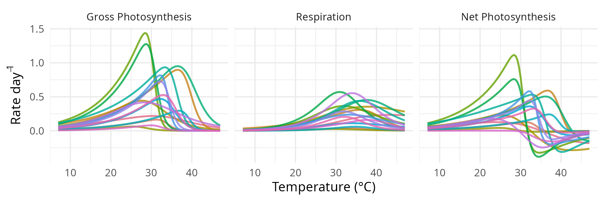

# Barton2020pairedTPCs

This repository contains code to re-estimate reaction norms for gross photosynthesis and respiration for 18 species of phytoplankton, using a Bayesian multivariate model which accounts for group-level correlations (i.e. across species and across replicates) among the different coefficients. The model is fitted using Stan (with brms as a front-end). Imputation is used for missing values, to prevent brms from dropping an existing rate value when the other, corresponding rate is missing (e.g. if respiration is missing, photosynthesis would be dropped as well, [retaining only complete cases](https://discourse.mc-stan.org/t/how-to-handle-na-values-in-multivariate-models/18800/8)).

The original analysis was conducted by Samuel Barton et al. (2020) and is reported in [10.1111/ele.13469](https://doi.org/10.1111/ele.13469).

The main motivation for the re-estimation, is that by accounting for correlations, we can generate realistic combinations of coefficients by drawing parameter samples from the joint posterior of the model. These samples represent ecologically plausible *paired* reaction norms for hypothetical species, which can be used in simulations of multispecies competitive communities whose dynamics play out under varying temperatures.

Here is an example, of 16 paired photosynthesis-respiration reaction norms and their net difference, based on parameter samples drawn from the posterior:

These are *not* estimates for the species whose data were used to fit the model; they are predictions generated from the model.
